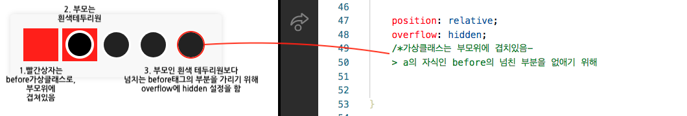
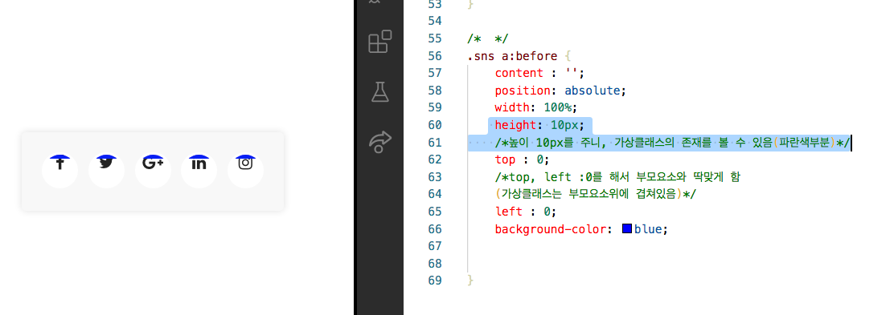

# hover시 밑줄이 생기는 menu

## 1. preview

### flex, before, after, transition, transform, overflow, fontawesome 사용
#### 요소의 앞뒤를 디자인하는 가상클래스 before, after


## 2. 코드 분석

### 1) html

#### (1) a태그안에 icon 태그
- `icon` : `fontawesome`의 태그를 이용한다.

```html
<body>
    <div class="sns">
        <a href="#none"><i class="fa fa-facebook"></i></a>
        <a href="#none"><i class="fa fa-twitter"></i></a>
        <a href="#none"><i class="fa fa-google-plus"></i></a>
        <a href="#none"><i class="fa fa-linkedin"></i></a>
        <a href="#none"><i class="fa fa-instagram"></i></a>
    </div>
</body>

```

<br/><br/>

### 2) css

#### (1) 필요한 기능 import하기
- `Google Web Font`, `Fontawesome 4.7`을 import한다.
            
```css
/* Google Web Font */
@import url('https://fonts.googleapis.com/css?family=Raleway&display=swap');

/* Fontawesome 4.7 */
@import url('https://stackpath.bootstrapcdn.com/font-awesome/4.7.0/css/font-awesome.min.css');

```

<br/>

#### (2) 내부 요소를 중앙정렬시키기
- `body`내부 요소를 중앙정렬한다.


```css
body{
    margin: 0;
    display: flex;
    justify-content: center;  /*수평정렬*/
    align-items: center;      /*수직정렬*/
    height: 100vh;
}

a {
    text-decoration: none;
    color: #222;
  }
```


<br/>

#### (3) sns 태그의 a태그 구성하기

-`.sns a`에 크기 지정 및 가상클래스 생성하기

  : `a`태그는 `inline`구조로, 크기값을 줄 수 없지만, `display: inline-block`을 하면 크기값을 줄 수 있음  

  : `a`태그 안의 아이콘을 `text-align`, `line-height`로 수직, 수평중앙 설정하기
  
<br/>

-`.sns a`의 가상클래스 `before`를 위한 사전설정
  
  : `a`태그의 가상 자식요소인 `before`의 위치 고정을 위해 `a`태그의 속성을 `position:relative`를 함
  
  :  그러면 가상클래스를 부모 위에 겹칠 수 있게 됨.
  
  : `overflow: hidden`으로 설정하여, `a`의 자식인 `before`의 넘친 부분을 없앰
  
  
  
```css
.sns{
    background-color: #f8f8f8;
    padding: 40px;
    border-radius: 10px;
    box-shadow: 0 0 20px rgba(0, 0, 0, 0.13);
}

.sns a{
    border: 5px solid white;
    display: inline-block;      /*a태그 크기 조정 가능*/
    width: 80px;
    height: 80px;
    border-radius: 50%;
    font-size: 40px;
    background-color: #fff;
    margin : 10px;
    
    /* a태그안의 아이콘을 수직, 수평중앙시키기 */
    text-align: center;  /*수평중앙*/
    line-height: 1.2;    /*수직중앙, 이 속성을 자신의 높이값만큼 주면 수직중앙에 위치함*/

    position: relative;  /* 가상 자식요소인 before의 위치 고정*/
    overflow: hidden;    /* before의 부모인 a태그의 overflow : hidden 설정*/
}
    
```

<br/>

#### (4) a태그의 가상자식 클래스 before

-`left:0`, `top:0`을 해서 가상클래스가 부모위에 겹쳐있게 함

- `bottom:0`으로 주어, 밑에서부터 변화가 나타나게 함 

- heignt가 0이었다가 100%로 되면 되는 구조로 만듬


  
```css
.sns a:before {
    content : '';
    position: absolute;
    width: 100%;
    height: 0%;  
    left : 0;           /*(가상클래스는 부모요소위에 겹쳐있음)*/
    bottom: 0;
    background-color: blue;
    transition: 0.5s;  /*before에서 이벤트 발생시 0.5초동안 이벤트가 발생하게 함*/
    

}

.sns a:hover:before{
    height: 100%;
}
    
```


<br/>

#### (5) before별로 다른 배경색 부여

- `transform: rotateY(360deg)`를 주어 `hover`시 글자가 회전하게 함
```css
.sns a:nth-child(1):before{
    background-color: #3b5999;
}

.sns a:nth-child(2):before{
    background-color: #55acee;
    
}

.sns a:nth-child(3):before{
    background-color: #dd4b39;
    
}

.sns a:nth-child(4):before{
    background-color: #0077B5;
    
}

.sns a:nth-child(5):before{
    background-color: #e4405f;
    
}

/* i태그의 아이콘에 relative를 주면, 글자가 나옴*/
.sns a .fa {
    position: relative;
    transition: 0.5s;  /*i태그에 효과발생시 0.5동안 발생시킴*/
}

/* i아이콘의 글자를 회전시킴 */
.sns a:hover .fa{
    transform: rotateY(360deg);
    color : white;
}
    
```

